# CareOS — Technical Architecture

**Document owner:** Engineering
**Status:** Foundational — designed to support all three phases from day one
**Audience:** Engineering team (incoming or existing)

---

## 1. Architectural principles

1. **Design for Phase 3 from Phase 1.** The data model and service boundaries below include entities/domains that Phase 1 doesn't use yet (claims, remittance) so that Phase 3 is an extension, not a rewrite. See `04_Data_Model_and_Schema.md`.
2. **Modular monolith first, extract services later.** Given a funded-but-not-infinite team, start with a well-modularized monolith (clear domain boundaries, separate modules/packages) rather than premature microservices. Extract a service only when a domain has genuinely different scaling, compliance, or team-ownership needs (the AI/ML inference layer is the first likely candidate for extraction — see Section 4).
3. **Multi-tenant by construction.** Every table/collection carries an `agency_id` (tenant key) from the first migration. Use Postgres Row-Level Security (RLS) policies keyed on `agency_id` as a defense-in-depth layer beneath application-level tenant scoping.
4. **Offline-first mobile.** The caregiver mobile app is the highest-stakes offline surface (EVV clock-in is often legally time-sensitive and must not be blocked by connectivity). Design local-first data sync (e.g., a local SQLite/WatermelonDB store with a sync engine) from the first mobile sprint.
5. **Compliance and audit logging are cross-cutting infrastructure, not features.** Build an audit-log middleware/interceptor once, used everywhere — not per-feature.

## 2. Recommended tech stack

| Layer | Recommendation | Rationale |
|---|---|---|
| Backend language/framework | TypeScript (Node.js, NestJS) or Python (FastAPI/Django) | Either is fine; choose based on team hiring pool. NestJS gives strong modular-monolith structure out of the box (matches principle #2). Python is preferable if the AI/ML team wants to keep inference code in the same language as the app layer. |
| Primary database | PostgreSQL | Mature RLS support for multi-tenancy, strong relational integrity for compliance-critical data (claims, EVV records), JSONB for flexible/evolving clinical fields. |
| Caching / queues | Redis (cache) + a durable queue (e.g., SQS, or Postgres-based queue like Graphile Worker for smaller scale) | EVV transmission, claims submission, and AI inference calls are all async, retryable workloads. |
| Search | Postgres full-text initially; add OpenSearch/Elasticsearch when applicant/caregiver search volume requires it | Avoid over-engineering search infra pre-PMF. |
| File/document storage | S3-compatible object storage with encryption at rest | Credentials, signed documents, visit-note attachments. |
| Mobile (caregiver app) | React Native or Flutter, with an offline-first local DB (WatermelonDB, SQLite + sync layer) | Cross-platform given a lean team; offline-first library choice is the critical decision, not the framework. |
| Web (agency admin app) | React (Next.js) | Standard, hire-able, supports both the admin dashboard and (later) the family portal from a shared component library. |
| AI/ML inference | Separate service (Python, FastAPI) fronting: (a) hosted LLM APIs for ranking/extraction/ambient-documentation reasoning, (b) a speech-to-text vendor for ambient documentation, (c) a lightweight in-house ranking model for caregiver-shift matching if hosted-LLM latency/cost doesn't fit the real-time scheduling use case | Isolating AI/ML lets this team iterate and scale independently, and lets you swap model vendors without touching core app code. |
| Infrastructure | AWS (or GCP) with infrastructure-as-code (Terraform) from day one; containerized services (ECS or EKS/Kubernetes once team size justifies the operational overhead) | HIPAA-eligible services are well-documented on both major clouds; choose based on team familiarity. |
| CI/CD | GitHub Actions (or equivalent) with required checks: lint, type-check, unit tests, security/dependency scan, migration-safety check | See `11_Engineering_Handoff_Guide.md` for pipeline detail. |
| Observability | Structured logging (e.g., Pino/structlog) shipped to a log platform (Datadog/Grafana stack), plus APM tracing and uptime monitoring on EVV/scheduling critical paths specifically | Given the 99.9% uptime NFR on scheduling/EVV, these paths need dedicated alerting, not generic app-wide monitoring. |

## 3. High-level system diagram

```mermaid
graph TB
    subgraph Client Layer
        CGApp[Caregiver Mobile App - offline-first]
        AdminApp[Agency Admin Web App]
        FamilyPortal[Family Portal - Phase 2+]
    end

    subgraph API Layer
        GW[API Gateway / BFF]
    end

    subgraph Core Domain Services - modular monolith
        AgencySvc[Agency and User Management]
        RecruitSvc[Recruiting and Onboarding]
        SchedSvc[Scheduling and EVV]
        DocSvc[Documentation and Care Plans - Phase 2]
        BillingSvc[Claims and Billing - Phase 3]
        ComplianceSvc[Compliance Rules Engine - cross-cutting]
    end

    subgraph AI ML Service - separately deployed
        RankML[Candidate and Shift Matching]
        AmbientML[Ambient Documentation - STT plus extraction]
        ClaimScrubML[Claim Scrubbing and Denial Prediction - Phase 3]
    end

    subgraph Data Layer
        PG[(PostgreSQL - RLS multi-tenant)]
        Redis[(Redis Cache and Queues)]
        S3[(Object Storage - documents, audio)]
    end

    subgraph External Integrations
        EVVAgg[State EVV Aggregators]
        BGCheck[Background Check Vendors]
        JobBoards[Job Boards]
        Clearinghouse[Claims Clearinghouse - Phase 3]
        Payroll[Payroll Provider]
        EHR[Legacy EHR Import]
    end

    CGApp --> GW
    AdminApp --> GW
    FamilyPortal --> GW
    GW --> AgencySvc
    GW --> RecruitSvc
    GW --> SchedSvc
    GW --> DocSvc
    GW --> BillingSvc

    RecruitSvc --> RankML
    SchedSvc --> RankML
    DocSvc --> AmbientML
    BillingSvc --> ClaimScrubML

    AgencySvc --> PG
    RecruitSvc --> PG
    SchedSvc --> PG
    DocSvc --> PG
    BillingSvc --> PG
    ComplianceSvc --> PG

    SchedSvc --> Redis
    BillingSvc --> Redis

    DocSvc --> S3
    RecruitSvc --> S3

    SchedSvc --> EVVAgg
    RecruitSvc --> BGCheck
    RecruitSvc --> JobBoards
    BillingSvc --> Clearinghouse
    BillingSvc --> Payroll
    AgencySvc --> EHR
```

## 4. Service/module boundaries (modular monolith decomposition)

| Module | Owns | Phase introduced |
|---|---|---|
| `agency` | Tenant/org records, users, roles, RBAC | Phase 1 |
| `recruiting` | Applicants, job postings, screening results, ranking calls to AI/ML service | Phase 1 |
| `credentialing` | Certifications, background checks, exclusion-list checks, expirations | Phase 1 |
| `scheduling` | Care plans (basic), visits/shifts, assignments, EVV records, gap-fill logic | Phase 1 |
| `compliance-rules` | Configurable rule engine used by scheduling (EVV exceptions), later by documentation and billing | Phase 1 (built generically), extended Phase 2/3 |
| `documentation` | Visit notes, ambient-doc sessions, care-plan detail, task/ADL tracking | Phase 2 |
| `family-portal` | Client/family-facing views (read-mostly, derives from other modules) | Phase 2 |
| `billing` | Eligibility, authorizations, claims, remittance, denial management | Phase 3 |
| `payroll-integration` | Hours-to-payroll bridging, pay-compliance rules | Phase 3 |
| `reporting` | Cross-module dashboards/analytics (reads from all modules, writes to none) | Phase 1 (basic), expands each phase |

**Extraction guidance for the incoming team:** if the modular monolith approach was not followed and modules are tangled, prioritize untangling `compliance-rules` first — it is consumed by every other module and must be a clean, injectable dependency, not scattered if/else logic.

## 5. AI/ML architecture detail

- **Candidate/shift ranking (Phase 1):** starts as a hosted-LLM-prompted scoring function (fast to ship, explainable via prompt-returned reasoning) with a caching layer for repeated feature combinations. Revisit for a lightweight in-house model (e.g., gradient-boosted ranking) only if latency or per-call cost becomes a problem at scale — do not over-build this before it's needed.
- **Ambient documentation (Phase 2):** pipeline is (1) on-device or streaming audio capture with explicit consent UI, (2) speech-to-text via a vendor API, (3) structured-field extraction via LLM prompted against the client's care plan schema, (4) mandatory human review/sign-off before the note is final. Raw audio retention policy must be configurable per agency/state (see `06_Compliance_and_Regulatory_Requirements.md`).
- **Compliance/claim scrubbing (Phase 2/3):** largely deterministic rules engine (payer-specific field requirements, authorization matching) augmented by an LLM layer for free-text inconsistency detection (e.g., visit note narrative contradicts logged tasks). Keep the deterministic rules engine as the source of truth for anything that blocks a claim submission — LLM output should advise/flag, not silently auto-correct billing-relevant data.

## 6. Data flow for the core "golden path" (Phase 1 → 3 integrated)

1. Client is onboarded with an authorized care plan and payer authorization (Phase 3 entity, populated even if Phase 3 isn't live yet — see data model).
2. Scheduler creates recurring visits; AI suggests caregiver assignment.
3. Caregiver clocks in/out via mobile app → EVV record created → transmitted to state aggregator.
4. (Phase 2) Caregiver completes ambient/structured documentation for the visit, reviewed and signed by supervisor if required.
5. (Phase 3) Nightly/batch job aggregates EVV + documentation + authorization data into claim-ready records; claim-scrubbing runs; clean claims submitted via clearinghouse.
6. (Phase 3) Remittance ingested, reconciled against claims; denials routed to a work queue.

This single path is why the data model must have the Phase 3 fields (authorization IDs, service-type billing codes) present from Phase 1 — retrofitting them onto historical visit records later is expensive and error-prone.

## 7. Environments

- **Local dev:** Docker Compose spinning up Postgres, Redis, and the modular-monolith app; seed scripts for representative multi-tenant test data (see `11_Engineering_Handoff_Guide.md`).
- **Staging:** mirrors production topology, connected to sandbox/test endpoints of all external integrations (EVV aggregator sandboxes, background-check vendor sandboxes, clearinghouse test environment) — **never** connect staging to production EVV aggregators or real payer clearinghouses.
- **Production:** blue/green or rolling deploys; database migrations gated by a migration-safety check in CI (no destructive migrations without an explicit two-person approval, given the compliance sensitivity of this data).

## 8. Key technical risks and mitigations

| Risk | Mitigation |
|---|---|
| State-by-state EVV aggregator fragmentation (different formats/APIs per state) | Build an internal EVV-transmission abstraction layer with a per-state adapter pattern; do not hardcode aggregator logic into the scheduling module (see `05_Integration_Specifications.md`) |
| Ambient documentation accuracy/liability | Human-in-the-loop sign-off is mandatory, never bypassed, even under a "fast mode" |
| Multi-tenant data leakage | Automated tests that attempt cross-tenant reads/writes must be part of the CI suite, not just manual QA |
| AI ranking bias in hiring | Documented bias-audit process before Epic 1.2.2 ships; periodic re-audit as the model or its inputs change |
| Vendor lock-in on EVV aggregators / background-check vendors | Adapter-pattern integration layer (as above) keeps vendor swaps to a config/adapter change, not a core-logic rewrite |
