# CareOS — Technical Architecture

**Document owner:** Engineering
**Status:** Foundational — designed to support all three phases from day one
**Audience:** Engineering team (incoming or existing)

---

## 1. Architectural principles

**1. Design for Phase 3 from Phase 1.** The data model and service boundaries include entities
Phase 1 does not use (claims, remittance), so Phase 3 extends the system instead of replacing
it. See `04_Data_Model_and_Schema.md`.

**2. Modular monolith first; extract services later.** For a funded but finite team, start with
a well-modularized monolith: clear domain boundaries, separate modules and packages. Extract a
service when a domain has different scaling, compliance, or team-ownership needs. The AI/ML
inference layer is the first likely candidate (Section 4).

**3. Multi-tenant by construction.** Every table carries an `agency_id` from the first
migration. Postgres Row-Level Security policies keyed on `agency_id` sit beneath
application-level tenant scoping as a second layer.

**4. Offline-first mobile.** The caregiver app is the highest-stakes offline surface. EVV
clock-in is legally time-sensitive and cannot be blocked by connectivity. Local-first data sync
(a local SQLite or WatermelonDB store with a sync engine) belongs in the first mobile sprint.

**5. Compliance and audit logging are infrastructure, not features.** One audit-log middleware,
used everywhere, rather than per-feature implementations.

## 2. Recommended tech stack

| Layer | Recommendation | Rationale |
|---|---|---|
| Backend language/framework | TypeScript (Node.js, NestJS) or Python (FastAPI/Django) | Either works; choose on hiring pool. NestJS gives modular-monolith structure out of the box, matching principle 2. Python is preferable if the AI/ML team wants inference code in the app-layer language. |
| Primary database | PostgreSQL | Mature RLS for multi-tenancy. Relational integrity for compliance-critical data (claims, EVV records). JSONB for evolving clinical fields. |
| Caching / queues | Redis for cache, plus a durable queue (SQS, or a Postgres-based queue such as Graphile Worker at smaller scale) | EVV transmission, claims submission, and AI inference are async retryable workloads. |
| Search | Postgres full-text first; OpenSearch or Elasticsearch when applicant and caregiver search volume requires it | Avoids over-engineering search infrastructure pre-PMF. |
| File/document storage | S3-compatible object storage, encrypted at rest | Credentials, signed documents, visit-note attachments. |
| Mobile (caregiver app) | React Native or Flutter, with an offline-first local DB (WatermelonDB, or SQLite plus a sync layer) | Cross-platform suits a lean team. The offline-first library is the critical decision; the framework is not. |
| Web (agency admin app) | React (Next.js) | Standard and hire-able. Supports the admin dashboard and, later, the family portal from one component library. |
| AI/ML inference | Separate Python/FastAPI service fronting hosted LLM APIs (ranking, extraction, ambient reasoning), a speech-to-text vendor, and optionally a lightweight in-house ranking model | Isolation lets this team iterate and scale independently, and lets model vendors be swapped without touching core app code. |
| Infrastructure | AWS or GCP, infrastructure-as-code (Terraform) from day one, containerized (ECS, or EKS/Kubernetes once team size justifies the operational overhead) | HIPAA-eligible services are documented on both clouds; choose on team familiarity. |
| CI/CD | GitHub Actions or equivalent, with required checks: lint, type-check, unit tests, security and dependency scan, migration-safety check | Pipeline detail in `12_Engineering_Handoff_Guide.md`. |
| Observability | Structured logging (Pino, structlog) to a log platform, plus APM tracing and uptime monitoring on EVV and scheduling paths specifically | The 99.9% uptime NFR applies to those paths. They need dedicated alerting, not app-wide monitoring. |

## 3. High-level system diagram

```mermaid
graph TB
    subgraph Client Layer
        CGApp[Caregiver Mobile App - offline-first]
        AdminApp[Agency Admin Web App]
        FamilyPortal[Family Portal - Phase 2+]
    end

    subgraph API Layer
        GW[API Gateway / BFF]
    end

    subgraph Core Domain Services - modular monolith
        AgencySvc[Agency and User Management]
        RecruitSvc[Recruiting and Onboarding]
        SchedSvc[Scheduling and EVV]
        DocSvc[Documentation and Care Plans - Phase 2]
        BillingSvc[Claims and Billing - Phase 3]
        ComplianceSvc[Compliance Rules Engine - cross-cutting]
    end

    subgraph AI ML Service - separately deployed
        RankML[Candidate and Shift Matching]
        AmbientML[Ambient Documentation - STT plus extraction]
        ClaimScrubML[Claim Scrubbing and Denial Prediction - Phase 3]
    end

    subgraph Data Layer
        PG[(PostgreSQL - RLS multi-tenant)]
        Redis[(Redis Cache and Queues)]
        S3[(Object Storage - documents, audio)]
    end

    subgraph External Integrations
        EVVAgg[State EVV Aggregators]
        BGCheck[Background Check Vendors]
        JobBoards[Job Boards]
        Clearinghouse[Claims Clearinghouse - Phase 3]
        Payroll[Payroll Provider]
        EHR[Legacy EHR Import]
    end

    CGApp --> GW
    AdminApp --> GW
    FamilyPortal --> GW
    GW --> AgencySvc
    GW --> RecruitSvc
    GW --> SchedSvc
    GW --> DocSvc
    GW --> BillingSvc

    RecruitSvc --> RankML
    SchedSvc --> RankML
    DocSvc --> AmbientML
    BillingSvc --> ClaimScrubML

    AgencySvc --> PG
    RecruitSvc --> PG
    SchedSvc --> PG
    DocSvc --> PG
    BillingSvc --> PG
    ComplianceSvc --> PG

    SchedSvc --> Redis
    BillingSvc --> Redis

    DocSvc --> S3
    RecruitSvc --> S3

    SchedSvc --> EVVAgg
    RecruitSvc --> BGCheck
    RecruitSvc --> JobBoards
    BillingSvc --> Clearinghouse
    BillingSvc --> Payroll
    AgencySvc --> EHR
```

## 4. Service/module boundaries

Modular monolith decomposition.

| Module | Owns | Phase introduced |
|---|---|---|
| `agency` | Tenant and org records, users, roles, RBAC | Phase 1 |
| `recruiting` | Applicants, job postings, screening results, ranking calls to the AI/ML service | Phase 1 |
| `credentialing` | Certifications, background checks, exclusion-list checks, expirations | Phase 1 |
| `scheduling` | Care plans (basic), visits and shifts, assignments, EVV records, gap-fill logic | Phase 1 |
| `compliance-rules` | Configurable rule engine, used by scheduling for EVV exceptions, later by documentation and billing | Phase 1 (built generically), extended Phase 2/3 |
| `documentation` | Visit notes, ambient-doc sessions, care-plan detail, task and ADL tracking | Phase 2 |
| `family-portal` | Client and family views, read-mostly, derived from other modules | Phase 2 |
| `billing` | Eligibility, authorizations, claims, remittance, denial management | Phase 3 |
| `payroll-integration` | Hours-to-payroll bridging, pay-compliance rules | Phase 3 |
| `reporting` | Cross-module dashboards and analytics; reads from all modules, writes to none | Phase 1 (basic), expands each phase |

**If the modules are already tangled:** untangle `compliance-rules` first. Every other module
consumes it, and it needs to be a clean injectable dependency rather than scattered conditional
logic.

## 5. AI/ML architecture detail

**Candidate and shift ranking (Phase 1).** Starts as a hosted-LLM scoring function: fast to
ship, explainable through prompt-returned reasoning, with a cache for repeated feature
combinations. A lightweight in-house model (gradient-boosted ranking, for example) is a
revisit if latency or per-call cost becomes a problem at scale.

**Ambient documentation (Phase 2).** Four stages:

1. On-device or streaming audio capture, with explicit consent UI.
2. Speech-to-text via a vendor API.
3. Structured-field extraction via LLM, prompted against the client's care-plan schema.
4. Human review and sign-off, required before the note is final.

Raw audio retention is configurable per agency and state
(`06_Compliance_and_Regulatory_Requirements.md`).

**Compliance and claim scrubbing (Phase 2/3).** A deterministic rules engine covering
payer-specific field requirements and authorization matching, plus an LLM layer for free-text
inconsistency detection such as a visit-note narrative contradicting logged tasks. The
deterministic engine is the source of truth for anything that blocks a claim submission. LLM
output advises and flags; it does not auto-correct billing-relevant data.

## 6. Data flow for the golden path

Phase 1 through Phase 3, integrated.

1. Client onboarded with an authorized care plan and payer authorization. The authorization is
   a Phase 3 entity, populated from Phase 1 even before Phase 3 is live.
2. Scheduler creates recurring visits. AI suggests caregiver assignment.
3. Caregiver clocks in and out via the mobile app. EVV record created, transmitted to the state
   aggregator.
4. Phase 2: caregiver completes documentation for the visit; supervisor reviews and signs where
   required.
5. Phase 3: a batch job aggregates EVV, documentation, and authorization data into claim-ready
   records. Claim scrubbing runs. Clean claims go to the clearinghouse.
6. Phase 3: remittance ingested and reconciled against claims. Denials route to a work queue.

This path is why the data model carries Phase 3 fields — authorization IDs, service-type billing
codes — from Phase 1. Retrofitting them onto historical visit records is expensive and
error-prone.

## 7. Environments

| Environment | Setup | Constraint |
|---|---|---|
| Local dev | Docker Compose: Postgres, Redis, the app. Seed scripts for representative multi-tenant test data (`12_Engineering_Handoff_Guide.md`) | — |
| Staging | Mirrors production topology, connected to sandbox endpoints of all external integrations: EVV aggregator sandboxes, background-check sandboxes, clearinghouse test environment | Never connect staging to production EVV aggregators or real payer clearinghouses |
| Production | Blue/green or rolling deploys. Migrations gated by a migration-safety check in CI | No destructive migration without explicit two-person approval, given the compliance sensitivity of this data |

## 8. Key technical risks and mitigations

| Risk | Mitigation |
|---|---|
| State-by-state EVV aggregator fragmentation: different formats and APIs per state | An internal EVV-transmission abstraction with a per-state adapter. Aggregator logic stays out of the scheduling module (`07_Integration_Specifications.md`) |
| Ambient documentation accuracy and liability | Human sign-off is mandatory and never bypassed, including under any "fast mode" |
| Multi-tenant data leakage | Automated tests attempting cross-tenant reads and writes, in the CI suite rather than manual QA |
| AI ranking bias in hiring | Documented bias audit before US-1.2.2 ships; re-audit as the model or its inputs change |
| Vendor lock-in on EVV aggregators and background-check vendors | The same adapter pattern. A vendor swap is a config and adapter change, not a core-logic rewrite |
