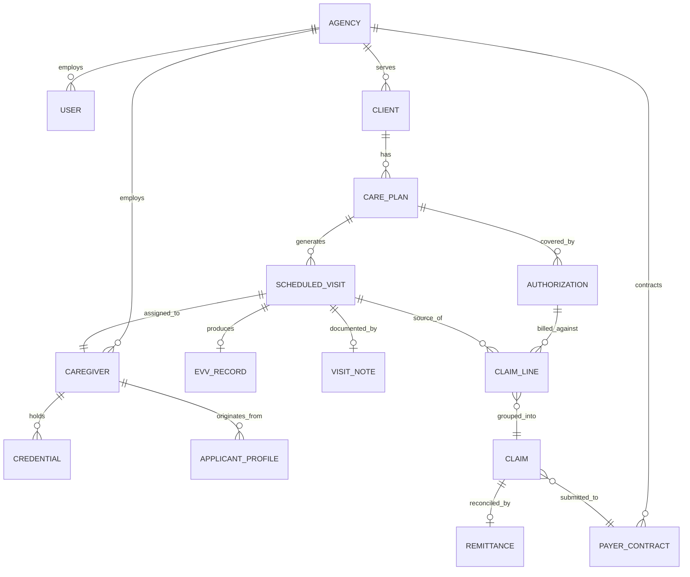

# CareOS — Data Model & Database Schema

**Document owner:** Engineering
**Status:** Foundational — includes Phase 3 entities intentionally (see `03_Technical_Architecture.md` Section 1)
**Audience:** Engineers, especially whoever builds the first migrations

---

## 1. Multi-tenancy convention

Every table below includes `agency_id` unless explicitly noted as global (e.g., a shared reference table of certification types). Enforce isolation with:
1. Application-layer scoping (every query includes `WHERE agency_id = :current_tenant`).
2. PostgreSQL Row-Level Security policies as a second, independent enforcement layer.
3. Automated cross-tenant-leak tests in CI (see `03_Technical_Architecture.md`, Section 8).

## 2. Entity-relationship overview

## 3. Core tables (Phase 1)

### `agency`
| Column | Type | Notes |
|---|---|---|
| id (PK) | uuid | Tenant key referenced by every other table |
| legal_name | text | |
| tax_id | text (encrypted) | |
| service_states | text[] | Drives which EVV aggregator adapters and compliance rule sets apply |
| service_lines | text[] | e.g., {home_care, home_health, hospice} |
| parent_org_id | uuid, nullable, FK → agency.id | Supports Phase 1.1.3 multi-location rollups |
| created_at, updated_at | timestamptz | |

### `app_user`
| Column | Type | Notes |
|---|---|---|
| id (PK) | uuid | |
| agency_id (FK) | uuid | |
| role | enum | owner_admin, scheduler, clinical_supervisor, caregiver, billing_rcm, auditor |
| email, phone | text | |
| auth_provider_id | text | External auth (e.g., Auth0/Cognito) subject ID |
| status | enum | invited, active, suspended |

### `caregiver`
| Column | Type | Notes |
|---|---|---|
| id (PK) | uuid | |
| agency_id (FK) | uuid | |
| app_user_id (FK, nullable) | uuid | Null until account activated |
| applicant_profile_id (FK, nullable) | uuid | Traceability back to recruiting funnel |
| legal_name, dob, address | text/date (encrypted PII fields) | |
| employment_status | enum | applicant, onboarding, active, inactive, terminated |
| exclusion_check_status | enum | not_run, cleared, flagged | Hard gate referenced in PRD US-1.3.2 |
| geo_location | point/geography | For drive-time and matching calculations |

### `credential`
| Column | Type | Notes |
|---|---|---|
| id (PK) | uuid | |
| caregiver_id (FK) | uuid | |
| credential_type | text (FK → reference table `credential_type_ref`) | e.g., CNA, HHA, RN license, CPR cert, TB test |
| issuing_body, credential_number | text | |
| issue_date, expiration_date | date | Drives renewal-reminder logic (US-1.3.3) |
| verification_status | enum | pending, verified, expired, rejected |
| document_s3_key | text | Pointer to object storage |

### `applicant_profile`
| Column | Type | Notes |
|---|---|---|
| id (PK) | uuid | |
| agency_id (FK) | uuid | |
| source | text | job board / referral / etc. |
| ranking_score | numeric, nullable | AI output |
| ranking_factors | jsonb | Top explanatory factors (PRD US-1.2.2 explainability requirement) |
| pipeline_stage | enum | applied, screened, offer, hired, rejected |

### `client`
| Column | Type | Notes |
|---|---|---|
| id (PK) | uuid | |
| agency_id (FK) | uuid | |
| legal_name, dob, address (encrypted) | | |
| primary_payer_type | enum | medicaid_waiver, medicare_advantage, private_pay, other |
| status | enum | active, on_hold, discharged |

### `care_plan`
| Column | Type | Notes |
|---|---|---|
| id (PK) | uuid | |
| client_id (FK) | uuid | |
| authorized_tasks | jsonb | ADLs/tasks list, used by Phase 2 task checklist |
| visit_frequency_rule | jsonb | e.g., RRULE-style recurrence definition |
| effective_start, effective_end | date | |
| clinical_supervisor_id (FK → app_user) | uuid | |

### `scheduled_visit`
| Column | Type | Notes |
|---|---|---|
| id (PK) | uuid | |
| care_plan_id (FK) | uuid | |
| caregiver_id (FK, nullable until assigned) | uuid | |
| scheduled_start, scheduled_end | timestamptz | |
| status | enum | open, assigned, confirmed, in_progress, completed, missed, cancelled |
| service_type_code | text | Billing-relevant service code — **populated from Phase 1 even though billing (Phase 3) doesn't consume it yet** |

### `evv_record`
| Column | Type | Notes |
|---|---|---|
| id (PK) | uuid | |
| scheduled_visit_id (FK) | uuid | |
| clock_in_time, clock_out_time | timestamptz | |
| clock_in_geo, clock_out_geo | point/geography, nullable | Null allowed for telephony fallback |
| capture_method | enum | mobile_gps, telephony, manual_exception |
| transmission_status | enum | pending, transmitted, acknowledged, rejected |
| aggregator_response_payload | jsonb | Raw response for audit/debug |
| six_element_snapshot | jsonb | Immutable snapshot of the six federally required EVV data elements at time of transmission |

## 4. Phase 2 tables

### `visit_note`
| Column | Type | Notes |
|---|---|---|
| id (PK) | uuid | |
| scheduled_visit_id (FK) | uuid | |
| ambient_session_id (FK, nullable) | uuid | Links to raw ambient-doc pipeline metadata (not raw audio — see retention policy) |
| structured_content | jsonb | Extracted fields matched to care_plan.authorized_tasks |
| narrative_text | text | |
| caregiver_signed_at | timestamptz, nullable | |
| supervisor_reviewed_at, supervisor_id (FK) | timestamptz, uuid, nullable | |
| compliance_flags | jsonb | Output of compliance-rules engine (missing fields, inconsistencies) |

### `ambient_session_metadata`
| Column | Type | Notes |
|---|---|---|
| id (PK) | uuid | |
| consent_captured | boolean | Must be true before processing per state consent law |
| consent_method | enum | verbal_logged, written | |
| audio_retained | boolean | Per-agency/state configurable |
| audio_s3_key | text, nullable | Null if not retained |
| transcript_s3_key | text | |

## 5. Phase 3 tables (present in schema from the start; unused until Phase 3 build)

### `payer_contract`
| Column | Type | Notes |
|---|---|---|
| id (PK) | uuid | |
| agency_id (FK) | uuid | |
| payer_name, payer_type | text, enum | |
| edi_connection_config | jsonb | Clearinghouse/payer connection details |

### `authorization`
| Column | Type | Notes |
|---|---|---|
| id (PK) | uuid | |
| care_plan_id (FK) | uuid | |
| payer_contract_id (FK) | uuid | |
| authorized_units, units_used | numeric | Drives US-3.1.2 exhaustion alerts |
| auth_start, auth_end | date | |

### `claim`
| Column | Type | Notes |
|---|---|---|
| id (PK) | uuid | |
| payer_contract_id (FK) | uuid | |
| status | enum | draft, scrubbed, submitted, accepted, rejected, paid, denied |
| edi_837_payload | jsonb/text | |

### `claim_line`
| Column | Type | Notes |
|---|---|---|
| id (PK) | uuid | |
| claim_id (FK) | uuid | |
| scheduled_visit_id (FK) | uuid | Direct traceability from claim line back to the EVV-verified visit |
| authorization_id (FK) | uuid | |
| billed_units, billed_amount | numeric | |
| scrub_flags | jsonb | Output of claim-scrubbing engine |

### `remittance`
| Column | Type | Notes |
|---|---|---|
| id (PK) | uuid | |
| claim_id (FK) | uuid | |
| edi_835_payload | jsonb/text | |
| paid_amount, adjustment_reason_codes | numeric, text[] | |
| denial_category | text, nullable | Feeds Phase 3 denial-management queue |

## 6. Reference (global, non-tenant) tables

- `credential_type_ref` — standardized list of certifications/licenses relevant to home-based care, mapped to state-specific requirements where they differ.
- `evv_aggregator_ref` — per-state mapping of which EVV aggregator/model applies (see `05_Integration_Specifications.md`).
- `payer_service_code_ref` — standardized billing/service type codes per payer type, used by both `scheduled_visit.service_type_code` and `claim_line`.

## 7. Audit log (cross-cutting, not tied to one module)

### `audit_log`
| Column | Type | Notes |
|---|---|---|
| id (PK) | uuid | |
| agency_id (FK) | uuid | |
| actor_user_id (FK) | uuid | |
| action | text | e.g., "visit_note.signed", "claim.submitted" |
| entity_type, entity_id | text, uuid | |
| before_state, after_state | jsonb | |
| occurred_at | timestamptz | |

This table is append-only at the database level (no UPDATE/DELETE grants for the application role) to satisfy the immutability requirement in the PRD's NFR table.

## 8. Migration sequencing guidance for a new team

If picking this up mid-build, migrate in this order regardless of which phase's features are being actively built, so the schema is never inconsistent with the architecture doc's "design for Phase 3 from Phase 1" principle:
1. `agency`, `app_user` (foundation)
2. `caregiver`, `credential`, `applicant_profile`
3. `client`, `care_plan`
4. `scheduled_visit`, `evv_record`
5. Reference tables (`credential_type_ref`, `evv_aggregator_ref`, `payer_service_code_ref`) — even if Phase 3 isn't built, `payer_service_code_ref` should exist so `scheduled_visit.service_type_code` has a real foreign key, not a free-text placeholder.
6. `audit_log` (before any other table goes live in production — this should never be "added later")
7. Phase 2 tables (`visit_note`, `ambient_session_metadata`) when Phase 2 work begins
8. Phase 3 tables (`payer_contract`, `authorization`, `claim`, `claim_line`, `remittance`) when Phase 3 work begins — but the FK target columns referenced by earlier tables (e.g., `scheduled_visit.service_type_code`) should already exist.
